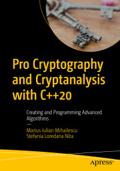

# Apress Source Code

This repository accompanies [*Pro Cryptography and Cryptanalysis with C++20*](https://www.apress.com/9781484265857) by Marius Iulian Mihailescu and Stefania Loredana Nita (Apress, 2021).

[comment]: #cover

Download the files as a zip using the green button, or clone the repository to your machine using Git.

## Releases

Release v1.0 corresponds to the code in the published book, without corrections or updates.

## Contributions

See the file Contributing.md for more information on how you can contribute to this repository.